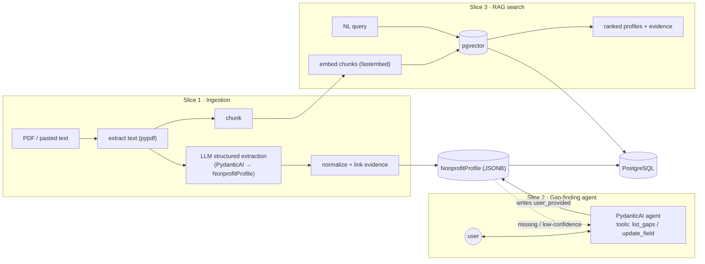

# Nonprofit Profile Builder

A working slice of an AI-powered nonprofit-profiling pipeline. It ingests a
nonprofit's documents, structures them into a profile with **per-field
provenance**, fills the gaps through a conversational agent, and makes profiles
searchable via RAG. It's built end-to-end on the target platform's stack —
**FastAPI + PydanticAI + Postgres/pgvector + React/TypeScript** — to learn and
demonstrate that stack hands-on, in three vertical slices that each work on their
own.

> Status: a real, runnable MVP (not a mockup). Everything runs locally with
> Docker after you add an API key.

---

## Architecture

Three stages, one datastore. The profile schema — with provenance on every
field — is the spine that ties them together.



**Data flow:** a document is extracted and chunked; an LLM populates a
`NonprofitProfile` where each field records whether it was `extracted`,
`inferred`, `user_provided`, or `missing` (with a confidence and a source quote
linked to its chunk). The agent reads that provenance to ask only about gaps and
writes answers back. Chunks are embedded into pgvector so profiles are
searchable by meaning, with each hit linked to the chunk that justified it.

### Layout

```
.
├── docker-compose.yml          # Postgres 16 + pgvector
├── .env.example                # all configuration, documented
├── backend/                    # FastAPI (async), PydanticAI, SQLAlchemy 2.0, Alembic
│   └── app/
│       ├── schemas/profile.py  # NonprofitProfile + TrackedField (the domain core)
│       ├── services/           # ingestion, agent, embeddings, search, chat
│       ├── models/             # SQLAlchemy ORM (profiles, chunks, conversations)
│       └── api/                # ingest, profile, chat, search routers
└── frontend/                   # React + TypeScript + Vite + Tailwind v4
    └── src/pages/              # Upload, ProfileReview, Chat, Search
```

---

## Design decisions

**Provenance on every field.** `NonprofitProfile` isn't a flat bag of values —
each field is a `TrackedField[T]` carrying `value`, `status`
(extracted/inferred/user_provided/missing), `confidence`, and a `source_quote`
resolved to the originating chunk. This is the project's spine: funders need to
know *where a claim came from*, and it's exactly the signal the gap-finding agent
keys off (`missing_or_low_confidence()`). The model fills the schema directly, but
the server then **deterministically normalizes** status/confidence and links
evidence — so classification rules live in our code, not the model's whim.
*Trade-off:* a richer schema the LLM must populate (heavier prompt, more to
validate) in exchange for trustworthy, queryable provenance.

**PydanticAI for the agent (and extraction).** The gap-finder uses typed
dependencies (the live profile), a read tool (`list_gaps`) and a write tool
(`update_field`), and a structured `AgentReply` output — idiomatic PydanticAI
rather than a hand-rolled tool loop. A bonus: agents are trivially mockable with
`TestModel`/`FunctionModel` + `agent.override(...)`, so the tests run with no
network and no API key. *Trade-off:* a newer library than the raw SDK, but the
typing and testability are worth it.

**pgvector over a dedicated vector DB.** Embeddings live in the same Postgres as
the profiles. One datastore means transactional consistency (a profile and its
searchable chunks can't drift apart), one thing to operate, and a clean path to
Supabase later (standard Postgres + pgvector, no exotic extensions). *Trade-off:*
fewer ANN tuning knobs than a specialized vector store at very large scale — not
a concern at this size, and an HNSW cosine index keeps queries fast.

**Local embeddings by default.** Anthropic has no embeddings endpoint, so
embeddings sit behind a swappable `EmbeddingProvider`. The default is local
(fastembed, `bge-small-en-v1.5`), so the whole app runs offline with **only an
`ANTHROPIC_API_KEY`**. *Trade-off:* lower quality than a hosted embedder — but
zero extra keys, and Voyage/OpenAI slot in behind the same interface.

**A small, cheap model by default.** `LLM_MODEL` defaults to a fast/cheap Claude
model and is fully configurable, with a `max_tokens` cap as a cost/safety guard.
*Trade-off:* extraction quality scales with the model — point `LLM_MODEL` at a
larger Claude model when accuracy matters more than cost.

---

## Setup

Prerequisites: **Docker**, **Node 18+**, and **[uv](https://docs.astral.sh/uv/)**
(`curl -LsSf https://astral.sh/uv/install.sh | sh`). uv installs the pinned
Python 3.12 itself.

**1. Configure** — copy the example env and add your key:

```bash
cp .env.example .env
# edit .env: set ANTHROPIC_API_KEY=sk-ant-...
```

The only required value is `ANTHROPIC_API_KEY`; embeddings default to local. If
ports 5432 / 8000 / 5173 are busy, override `POSTGRES_PORT`, the uvicorn
`--port`, and `VITE_PORT` / `VITE_API_TARGET`.

**2. Database** — start Postgres + pgvector:

```bash
docker compose up -d
```

**3. Backend** — install deps, migrate, run (from `backend/`):

```bash
cd backend
uv sync
uv run alembic upgrade head
uv run uvicorn app.main:app --reload          # http://localhost:8000  (docs at /docs)
```

**4. Frontend** — install and run (from `frontend/`):

```bash
cd frontend
npm install
npm run dev                                    # http://localhost:5173
```

Open the frontend, upload a PDF or paste text, review the extracted profile,
chat to fill the gaps, then search across everything you've ingested.

### Checks

```bash
cd backend
uv run ruff check .
uv run pytest        # no DB or API key required (LLM is mocked)
```

---

## What I'd build next

- **Auth & multi-tenancy** — org/user accounts; profiles scoped per tenant.
- **Supabase deployment** — the schema is plain Postgres + pgvector, so this is a
  connection-string change plus migrations; add Supabase Auth + storage for PDFs.
- **Stripe Connect donation rails** — let funders give to a profile; payout via
  Connect to the nonprofit.
- **Portfolio allocation** — model a funder's portfolio across profiles, with
  allocation suggestions driven by cause area, evidence standard, and funding gaps.
- **Stronger RAG** — embed profile fields (not just source chunks), add a
  reranking pass, and move embedding/ingestion to background jobs for large docs.
- **Evals** — a small graded set for extraction accuracy and agent question
  quality, wired into CI.
```
